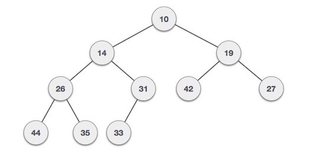
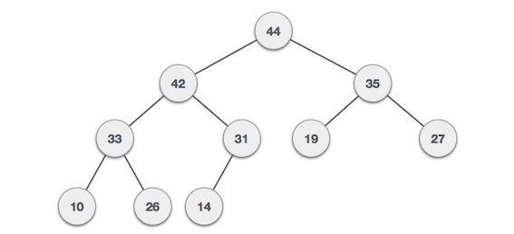
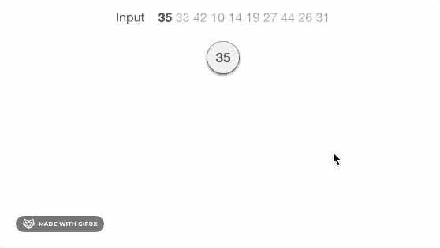
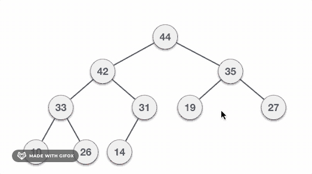

# 堆

堆是平衡二叉树数据结构的一种特殊情况，在该结构中，根节点密钥与其子节点进行比较并进行相应安排。如果a具有子节点b，则 keys(a) >=keys(b)。当parent的值大于child的值时，此属性将生成Max Heap（最大堆）。基于此标准，堆可以分为两种类型

```
For Input -> 35 33 42 10 14 19 27 44 26 31
```

* **最小堆** - 根节点的值小于或等于其子节点中的一个。

  

* **最大堆** - 根节点的值大于或等于其任何子节点的值

  

两种树都是使用相同的输入和到达顺序构造的。

## 最大堆构造算法

我们将使用相同的示例来演示如何创建最大堆。创建最小堆的过程类似，但是我们使用最小值而不是最大值。

我们将通过一次插入一个元素来到处最大堆的算法。在任何时候，堆都必须维护其属性。插入时，我们还假设我们正在已堆化的树中插入节点。

```
Step 1 - Create a new node at the end of heap.
Step 2 - Assign new value to the node.
Step 3 - Compare the value of this child node with its parent.
Step 4 - If value of parent is less than child, then swap them.
Step 5 - Repeat step 3 & 4 util Heap property holds.
```

**注** - 在最小堆构造算法中，我们期望父节点的值小于子节点的值。

让我们通过动画插图了解Max Heap的构造。我们考虑与之前使用相同的输入样本。

  

**注** - 上图不完整，但意思明确

## 最大堆删除算法

让我们导出一种从最大堆中删除的算法。最大（最小）堆中的删除始终发生在根部，以删除最大（或最小）值。

```
Step 1 - Remove root node.
Step 2 - Move the last element of last level to root.
Step 3 - Compare the value of this child node with its parent.
Step 4 - if value of parent is less than child, then swap them.
Step 5 - Repeat step 3 & 4 util Heap property holds.
```

  

