# 生成树

生成树是图 G 的子集，图 G 的所有顶点都覆盖有尽可能少的边。因此，生成树没有环，也无法断开连接。

通过这个定义，我们可以得出一个结论，即每个连通和无向的图 G 至少都有一个生成树。断开连接的图没有任何生成树，因为它无法跨越到其所有顶点。

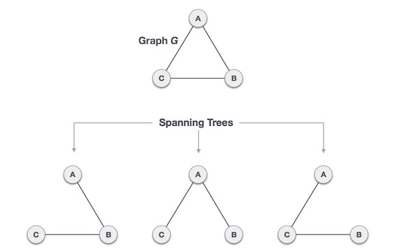

我们从一张完整的图上发现了三棵生成树。一个完整的无向图最多可以具有
nn-2个生成树，其中 n 是节点数。在上述示例中，n 为 3，因此 33-2等于 3 棵生成树。

### 生成树的属性

一个图可以具有多个生成树。以下是连接到图 G 的生成树的一些属性

- 连通图 G 可以具有一个以上的生成。
- 图 G 的所有可能的生成树都具有相同数量的顶点和边。
- 生成树没有任何循环。
- 从生成树中删除一条边将使图断开连接，即生成树已是最小连接。
- 在生成树上添加一条边会创建一个电路或环路，即生成树最大程度是非循环的。

### 生成树的数学性质

- 生成树具有**n-1**个边，其中**n**是节点（顶点）的数量。
- 从一个完整的图中，通过去除最大**e-n+1**个边，我们可以构建生成树。
- 一个完整的图最多可以包含nn-2个生成树

因此，生成树是已连接图 G 的子集，而未连接图没有生成树。

### 生成树的应用

生成树基本上用于查找连接图中所有节点的最小路径。生成树常见应用是：

- 民用网络规划
- 计算机网络路由协议
- 聚类分析

举例：城市网路是一个巨大的图，并且现在规划部署电话线，以最少的线路连接所有的城市节点。

## 最小生成树

在加权图中，最小生成树是比同一图的所有其他生成树具有最小成本的生成树。在现实世界中，可以将这种成本度量为距离，拥塞，交通负荷或表示边的任意值。

### 最小生成树算法

- 克鲁斯卡尔算法
- 普里姆算法

两者都是贪婪算法。

## 克鲁斯卡尔算法

克鲁斯卡尔算法（Kruskal)找到最小成本生成树的算法使用贪婪方法。该算法将图形视为森林，并将其具有的每个节点视为单独的树。一棵树只有在所有可用选项中成本最低且不违反 MST（最小生成树）属性的情况下，才与另一棵树连接。

要了解 Kruskal 的算法，让我们考虑以下示例-

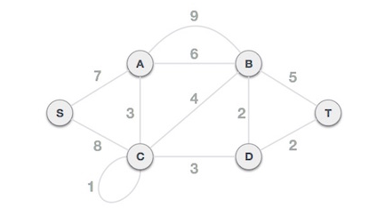

### 第一步 - 删除所有循环和平行边

从给定的图形中删除所有循环和平行边

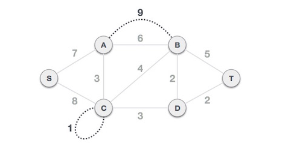

如果边平行，则保持成本最低的边，并去除所有其他边

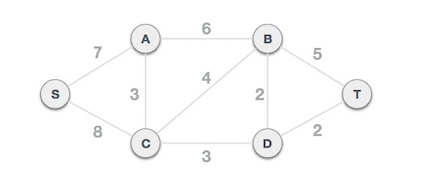

### 第二步 - 按成本递增顺序排列所有边

下一步是创建一组边和成本，并以成本的升序排列它们。

| B,D | D,T | A,C | C,D | C,B | B,T | A,B | S,A | S,C |
| --- | --- | --- | --- | --- | --- | --- | --- | --- |
| 2   | 2   | 3   | 3   | 4   | 5   | 6   | 7   | 8   | 

### 步骤三 - 添加成本最小的边

现在开始从成本最小的边开始向图添加边。在整个过程中，将继续检查连接属性是否保持完整。如果通过添加一条边，导致生成树属性不成立，那么将考虑在图中不包括此边。

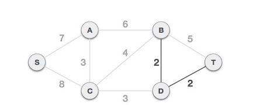

最小成本是 2，涉及边是 B,D 和 D,T。添加这两条边。添加它们不会违反生成树属性，因此继续进行下一个边的选择。

下一个成本是 3，且关联的边为 A，C 和 C，D。添加它们。

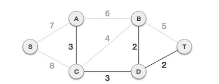

表中下一个成本是 4，观察到将其相加会在图中创建一个环路

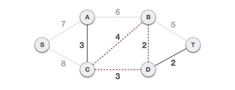

在此过程中，我们将忽略/避免产生环路的所有边，故此忽略它。

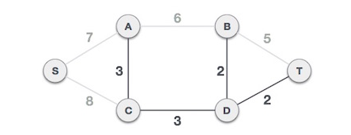

继续观察到成本 5 和 6 的边也会产生环路，因此忽略，继续前进。

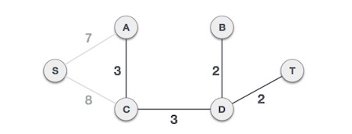

现在我们只剩下一个要添加的节点。在可用的两个成本 7 和 8 之间，应该选择成本 7。

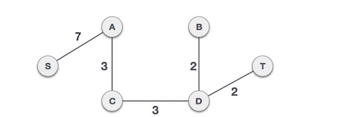

通过添加边 S，A，我们包括了图的所有节点，上图就是最小成本生成树。

## 普里姆算法

普里姆算法的寻找最小成本生成树的算法使用贪婪方法。与最短路径优先算法具有相似之处。

普里姆算法与克鲁斯卡尔算法相反，它将节点视为一棵树，并继续从给定的图向生成树添加节点。

为了与克鲁斯卡尔算法进行对比并更好的理解，我们使用相同的示例 -

### 步骤一 - 移除所有回路和平行边

从给定的图形中删除所有循环和平行边。如果边平行，则保持成本最低的边，并去除所有其他边。

### 步骤二 - 选择任意节点作为根节点

在这种情况下，我们选择 S 节点作为普里姆生成树的根节点。该节点是任意选择的，因此任何节点都可以是根节点。有人可能想知道为什么任何节点都可以成为根节点，因为在生成树中，包括图的所有节点，并且由于它是连接的，因此必须至少有一条边，将其与树的其他部分连接起来。

### 步骤三 - 检查输出边并选择成本较低的边

选择根节点 S 后，我们看到 S，A 和 S，C 分别是权重为 7 和 8 的两个边。我们选择 S，A，因为它比另一个成本小。

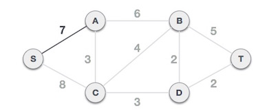

现在，将树 S-7-A 视为一个节点，检查所有从树出的边，我们选择成本最低的一种并将其包含在树中。

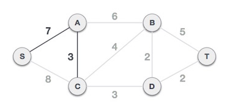

在该步骤之后，形成 S-7-A-3-C 树。现在，我们再次将其视为节点，检查其所有边，但是只选择成本最低的边，在这种情况下，C-3-D 是新边，比其他边的成本 8、6、4 等少。

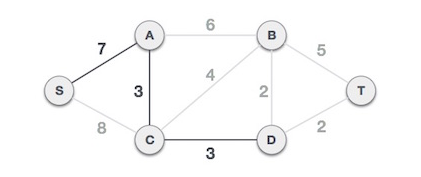

在将节点 D 添加到生成树之后，现在有两个边具有相同的成本，即 D-2-T 和 D-2-B。因此我们可以添加其中一个。但是下一步中，将再次是边 2 成本最低。因此，最终的生成树

我们会发现，使用两种不同算法的同一图的输出生成树是相同的。
