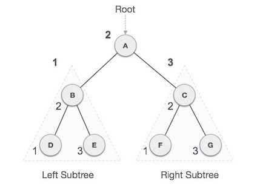

# 树数据结构

树表示通过边连接的节点。此处介绍二叉树和二叉搜索树。

## 二叉树

二叉树是用于数据存储目的的特殊数据结构。二叉树有一个特殊条件，即每个节点最多可以有两个子节点。二叉树同时具有数组和链表的优点，因为搜索与数组一样快，插入或删除操作也与链表一样快。


### 术语

- **路径** - 路径是指沿着树的边的节点序列。
- **根** - 树顶部的节点称为根。每棵树只有一个根，并且从根节点到任何节点只有一条路径。
- **父节点** - 除根节点之外的任何节点都具有一个边向上连接的节点称为父节点。
- **子节点** - 给定节点下方通过其边向下连接的节点称为其子节点。
- **叶子** - 没有任何子节点的节点称为叶子节点。
- **子树** - 子树表示节点的后代。
- **访问** - 访问是指在控件位于节点上时节点的值。
- **遍历** - 遍历是指以特定顺序通过节点。
- **级别** - 节点的级别表示节点的生成。如果根节点处于级别 0，则其下一个子节点处于级别 1，其子代处于级别 2，以此类推。
- **keys** - key 表示节点的值，基于该值将对节点执行搜索操作。

## 二叉搜索树

二叉搜索树表现除特殊的行为。节点的左节点的值必须小于其父节点的值，并且节点的右节点的值必须大于其父节点的值。


我们将使用节点对象来实现树，并通过引用将他们连接起来。

### 树节点

编写树节点的代码与下面给出的代码相似。他具有一个数据部分，并引用其左子节点和右子节点。

```java
class Node {
	int data;
	Node left;
	Node rigth;
}
```

在树中，所有节点共享相同的构造。

### 二叉搜索树（BST）基本操作

可以对二叉搜索树数据结构进行的基本操作如下：

- **插入** - 在树中插入元素/创建树。
- **搜索** - 搜索树中的元素。
- **中序遍历** - 以中序方式遍历树。
- **先序遍历** - 以先序方式遍历树。
- **后序遍历** - 以后序方式遍历树。

### 插入操作

第一次插入将创建树。之后，无论何时要插入元素，都首先要找到其正确位置。从根节点开始搜索，然后如果数据小于键值，则在左侧子树中搜索空位置并插入数据。否则，在右侧子树中搜索空位置并插入数据。

### 算法

```
if root is Null
	then create root node
return
if root exists then
	compare the data with node.data

	while utile insertion position is located
		if data is greater than node.data
			goto right subtree
		else
			goto left subtree
	endwhile

	insert data
end if
```

### 实现

```java
public class BinarySearchTree {
  static class Node {
  	int data;
  	Node left;
  	Node right;
  	Node(int data){
    	this.data = data;
  	}
  }

	Node root;

	void insert(int data){
  	Node node = new Node(data);
  	if(root == null){
      root = node;
    }else {
      Node current = root;
      Node parent;
      while(true){
        parent = current;
        if(data < parent.data){
          current = current.left;
          if(current == null){
            parent.left = node;
            return;
          }
        }else {
          current = current.right;
          if(current == null){
            parent.right = node;
            return;
          }
        }
      }
    }
	}
}
```

### 搜索操作

每当要搜索元素时，都从根节点开始搜索，然后，如果数据小于键值，则在左侧子树中搜索该元素。否则，在右侧子树中搜索该元素。每个节点都遵循相同的算法。

### 算法

```
if root.data is equal to search.data
	return root
else
	while data not found
		if data is greater than node.data
			goto right subtree
		else
			goto left subtree
		if data found
			return node
	endwhile
	return data not found
end if
```

### 实现

```
public class BinarySearchTree {
  static class Node {
  	int data;
  	Node left;
  	Node right;
  	Node(int data){
    	this.data = data;
  	}
	}

	Node root;
	Node search(int data){
		Node current = data;
		while(true){
			if(current == null){
				return null;
			}else {
				if(current.data == data){
					return current;
				}else if(current.data > data){
					current = current.left;
				}else {
					current = current.right;
				}
			}
		}
	}
}
```

### 中序遍历

在这种遍历方法中，首先访问左子树，然后访问根，然后再访问右子树。我们应该永远记住，每个节点都可能代表一个子树本身。

如果按中序遍历二叉树，则输出将产生升序排序的键值。



该树的中序遍历输出为：D --> B --> E --> A --> F --> C --> G

### 算法

```
Util all nodes are traversed -
Step 1 - Recursively traverse left subtree
Step 2 - Visit root node.
Step 3 - Recursively traverse right subtree
```

### 实现

```java
public class BinarySearchTree {
  static class Node {
  	int data;
  	Node left;
  	Node right;
  	Node(int data){
    	this.data = data;
  	}
	}

	Node root;
	void inOrder(Node node){
		if(node != null){
			inOrder(node.left);
			System.out.println(node.data);
			inOrder(node.right);
		}
	}
}
```

### 先序遍历

在这种遍历方法中，首先访问根节点，然后是左子树，最后是右子树。

中序遍历图使用先序遍历输出结果为：A --> B --> D --> E --> C --> F --> G

### 算法

```
Until all nodes are traversed -
Step 1 - Visit root node.
Step 2 - Recursively traverse left subtree.
Step 3 - Recursively traverse right subtree.
```

### 实现

```java
public class BinarySearchTree {
  static class Node {
  	int data;
  	Node left;
  	Node right;
  	Node(int data){
    	this.data = data;
  	}
	}

	Node root;
	void preOrder(Node node){
		if(node != null){
			System.out.println(node.data);
			preOrder(node.left);
			preOrder(node.right);
		}
	}
}
```

### 后序遍历

在这种遍历方法中，根节点是最后访问的，首先先遍历左侧子树，然后是右侧子树，最后遍历根节点。

中序遍历图使用后序遍历输出结果为：D --> E --> B --> F --> G --> C --> A

### 算法

```
Until all nodes are traversed -
Step 1 - Recursively traverse left subtree.
Step 2 - Recursively traverse right subtree.
Step 3 - Visit root node.
```

### 实现

```java
public class BinarySearchTree {
  static class Node {
  	int data;
  	Node left;
  	Node right;
  	Node(int data){
    	this.data = data;
  	}
	}

	Node root;
	void postOrder(Node node){
		if(node != null){
			postOrder(node.left);
			postOrder(node.right);
      System.out.println(node.data);
		}
	}
}
```
