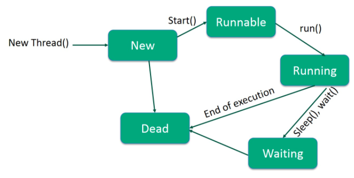

# Java并发编程

Java是一种多线程编程语言，意味着可以使用Java开发多线程程序。多线程程序包含两个或多个可以同时运行的部分，并且每个部分可以同时处理不同的任务，从而可以最佳利用可用资源，尤其是在计算机具有多个CPU的情况下。多线程可以编写一种方式，使多个活动在同一程序中同时进行。

## 线程的生命周期

线程在其生命周期中会经历各个阶段。例如，线程是先创建，然后启动、运行，最后死亡的。下图显示了线程的完整生命周期。



### 线程生命周期的各个阶段说明

- **新建**-新线程以新状态开始其生命周期。它将保持这种状态，直到程序启动线程为止。它也称为**出生线程**。
- **Runnable接口**-一个刚出生的线程启动后，该线程进入可运行状态。处于此状态的线程被视为正在执行其任务。
- **等待中**-有时，线程在等待另一个线程执行任务时会转换为等待状态。仅当另一个线程发出信号通知等待的线程继续执行时，一个线程才转换回可运行状态。
- **定时等待**-可运行线程可以在指定的时间间隔内进入定时等待状态。当该时间间隔到期或发生等待事件时，处于此状态的线程将转换回可运行状态。
- **终止（终止）** -可运行线程在完成其任务或终止时进入终止状态。

### 线程优先级

每个Java线程都有一个优先级，可以帮助操作系统确定线程调度的顺序。

Java线程优先级在MIN_PRIORITY（常数1）和MAX_PRIORITY（常数10）之间。默认情况下，每个线程的优先级为NORM_PRIORITY（常数5）。

具有较高优先级的线程对程序更重要，应在较低优先级的线程之前为其分配处理器时间。但是，线程优先级不能保证线程执行的顺序，并且很大程度上取决于平台。

### 线程创建的两个方式

* 通过实现Runable接口
* 通过继承Thread类

```java
class MyRunnable implements Runnable {
  @Override
  public void run(){
    System.out.println("通过实现Runnable创建线程");
  }
  public static void main(String[] args){
    new Thread(new MyRunnable()).start();
  }
}
```

```java
class MyThread extends Thread {
	@Override
  public void run(){
    System.out.println("通过继承Thread创建线程");
  }
  public static void main(String[] args){
    new MyThread().start();
  }
}
```

### 线程间的通讯

在开发两个或多个线程交换某些信息的应用程序时，线程间通信非常重要。主要用到三个简答的方法和同步锁。

* wait()
* notify()
* notifyAll()

这些方法已在Object中作为**最终** 方法实现，因此在所有类中都可用。并且只能在同步锁上下文中调用这些方法。

#### 生产者消费者模式

```java
class ProducerConsumerDemo {
  boolean flag =false;
  List<String> list = new ArrayList<>();
  public synchronized void produce(String message){
    if(flag){
      try{
        wait();
      }catch(InterruptedException e){}
    }
    list.add(message);
    System.out.println("Produce: "+ message);
    flag = true;
    notifyAll();
  }
  
  public synchronized void consume(){
    if(!flag){
      try{
        wait();
      }catch(InterruptedException e){}
    }
    if(!list.isEmpty()){
      String message = list.remove(0);
      System.out.println("Consume: "+ message);
    }
    flag = false;
    notifyAll();
  }
  
  static class Producer implements Runnable {
    private final ProducerConsumerDemo demo;
    Producer(ProducerConsumerDemo demo){
      this.demo = demo;
    }
    @Override
    public void run(){
      for(int i=0 ;i< 10;i++){
        demo.produce("message : "+ i);
      }
    }
  }
  
  static class Consumer implements Runnable {
    private final ProducerConsumerDemo demo;
    Consumer(ProducerConsumerDemo demo){
      this.demo = demo;
    }
    @Override
    public void run(){
      for(int i=0; i< 10;i++){
        demo.consume();
      }
    }
  }
  
  public static void main(String[] args){
    ProducerConsumerDemo demo = new ProducerConsumerDemo();
    new Thread(new Producer()).start();
    new Thread(new Consumer()).start();
  }
  
}
```

